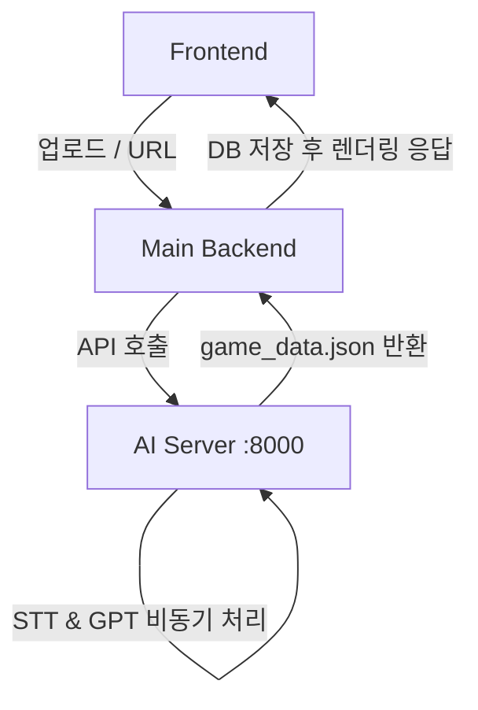

# TADAC AI Backend

TADAC(타닥) 프로젝트의 AI 기능을 담당하는 백엔드 모듈입니다.
사용자가 업로드한 영상이나 YouTube URL을 분석하여, **빈칸 채우기 게임 데이터**, **중간 퀴즈**, **AI 복습 요약**, 그리고 **Shorts(쇼츠)** 영상을 자동으로 생성합니다.

---

## 🧭 주요 기능

1. **오디오 및 자막 추출**
   - 파일 업로드 및 YouTube URL 지원 (`yt-dlp` 사용).
   - YouTube 수동 자막 우선 사용, 없을 시 Whisper를 이용한 고품질 STT(Speech-to-Text) 수행.
2. **자막 교정 및 정제 (Refine)**
   - GPT를 사용하여 STT 중 발생한 오인식, 비문 등을 문맥에 맞게 자연스럽게 교정.
3. **핵심 키워드 추출 및 게임 데이터 생성**
   - 영상 내용 중 중요한 키워드를 추출하여 빈칸 채우기용 자막 세그먼트를 생성.
   - 단어 타격/낙하 게임을 위한 타이밍, 위치 정보 계산.
4. **퀴즈 및 복습 노트 생성**
   - 영상의 핵심 내용을 바탕으로 AI가 다지선다형 퀴즈 자동 출제.
   - 단원/챕터별 중요 내용을 마크다운 형태의 복습 노트(AI Summary)로 요약.
5. **Shorts 생성 (Optional)**
   - 영상의 하이라이트 부분을 추출해 짧은 세로형 쇼츠 동영상으로 렌더링.

> ⚠️ **참고: 난이도 관리 메커니즘**
> AI는 처리 시간을 최소화하기 위해 영상 데이터를 분석하여 **최대 빈칸 개수(2개)** 및 기준 타이밍을 **한 번만 생성**하여 반환합니다.
> 실제 게임 중 플레이어의 난이도(초급/중급/고급 등)에 따른 속도 조절과 빈칸 개수 표시는 **프론트엔드에서 실시간으로 계산**합니다.

---

## ⚙️ 시스템 요구사항 및 초기 설정

- **Python 버젼**: Python 3.10 이상
- **의존성(OS)**: `ffmpeg` 필수 (오디오 및 영상 처리용)
- **API 키**: `.env` 또는 시스템 환경 변수에 OpenAI API 키 등록 필요
  ```env
  OPENAI_API_KEY=sk-...
  ```

### 설치

```bash
# 1. 패키지 설치
pip install -r requirements.txt

# 2. ffmpeg 설치 (macOS 예시)
brew install ffmpeg

# 3. 서버 실행
python api.py
```
> 서버는 기본적으로 `http://localhost:8000` 에서 구동됩니다.

---

## 📌 아키텍처 및 데이터 흐름



- 프론트엔드는 직접 AI 서버를 호출하지 않고, **메인 백엔드를 통해서만 우회 연동**됩니다.

---

## 🚀 API 엔드포인트 명세

자세한 데이터 스키마는 내부 [AI_SPEC.md](./AI_SPEC.md), [BACKEND_HANDOFF.md](./BACKEND_HANDOFF.md) 를 참고하세요.

### 1. Health Check
서버 정상 작동 및 API 키 등록 여부를 확인합니다.
```http
GET /api/health
```

### 2. YouTube URL 분석
```http
POST /api/process-url
Content-Type: application/json
```
**Request Body**:
```json
{
  "url": "https://www.youtube.com/watch?v=VIDEO_ID",
  "language": "ko",
  "refine": true,
  "shorts": false
}
```

### 3. 직접 파일 업로드 분석
```http
POST /api/process
Content-Type: multipart/form-data
```
**Form Fields**:
- `file`: (필수) 영상 파일 `.mp4`, `.webm`
- `language`: (선택) 언어 (기본 `ko`)
- `refine`: (선택) GPT 자막 교정 수행 여부 (기본 `true`)
- `shorts`: (선택) 쇼츠 비디오 렌더링 여부 (기본 `false`)

### 응답 데이터 구조 (game_data)
모든 분석 API는 아래와 같은 구조의 최종 게임 데이터 JSON을 반환합니다.
```json
{
  "ai_summary": "마크다운 형태의 복습 노트 내용...",
  "subtitles": [
    {
      "segment_id": 0,
      "blank_text": "______가 중요합니다.",
      "blanks": [ ... ]
    }
  ],
  "fall_events": [ ... ],
  "quizzes": [ ... ],
  "config": { ... },
  "stats": { ... }
}
```

---

## 🗂 주요 파일 구조

- **`api.py`**: FastAPI 웹 서버 진입점 및 HTTP 라우팅
- **`pipeline.py`**: STT -> 교정 -> 키워드 -> 쇼츠로 이어지는 핵심 통합 파라프라인 로직
- **`stt.py`**: Whisper 모델을 사용한 음성 인식 모듈
- **`transcript_refiner.py`**: GPT를 이용한 텍스트 교정기
- **`combined_processor.py`**: STT 결과와 키워드를 매핑하는 로직
- **`shorts_generator.py` / `shorts_builder.py`**: 쇼츠 비디오/대본 생성 로직
- **`youtube_audio.py` / `youtube_subtitle.py`**: YouTube 다운로드 및 처리
- **`AI_SPEC.md` / `BACKEND_HANDOFF.md`**: 백엔드 연동 관련 최신 명세서 및 주의사항
