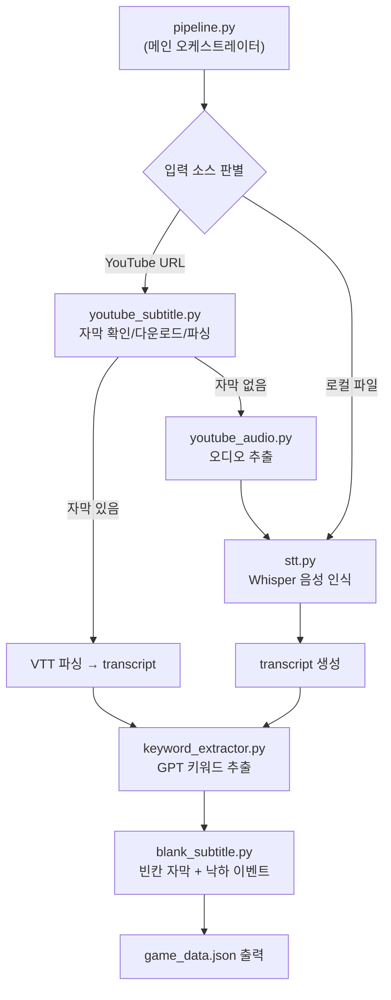
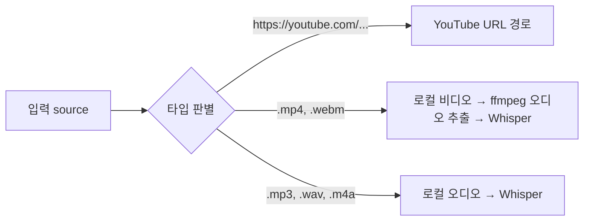
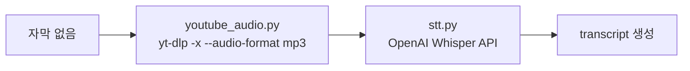
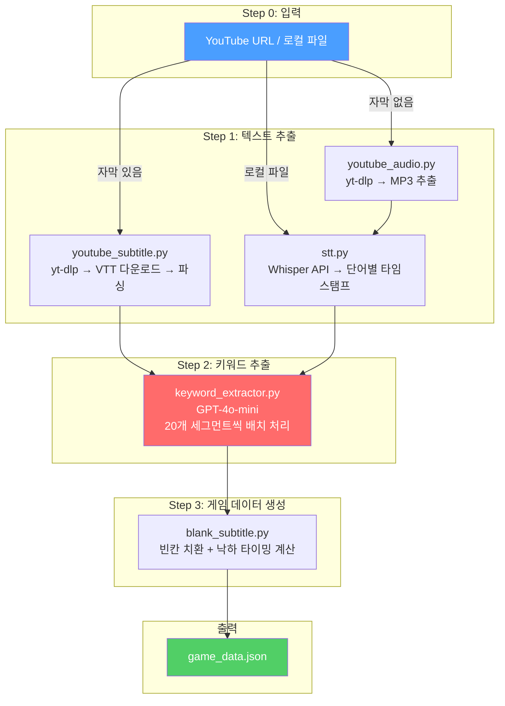

# TADAC AI Pipeline 전체 흐름 분석

## 아키텍처 개요



---

## 파일 구성 및 역할

| 파일 | 역할 | 외부 의존성 |
|:---|:---|:---|
| [pipeline.py](file:///Users/yeonbee/main/documents/Workspace/TADAC/backend/ai/pipeline.py) | 전체 파이프라인 오케스트레이터 | 없음 |
| [youtube_subtitle.py](file:///Users/yeonbee/main/documents/Workspace/TADAC/backend/ai/youtube_subtitle.py) | YouTube 자막 확인/다운로드/VTT 파싱 | `yt-dlp` (CLI) |
| [youtube_audio.py](file:///Users/yeonbee/main/documents/Workspace/TADAC/backend/ai/youtube_audio.py) | YouTube 오디오 추출 | `yt-dlp` (CLI) |
| [stt.py](file:///Users/yeonbee/main/documents/Workspace/TADAC/backend/ai/stt.py) | OpenAI Whisper 음성→텍스트 | `OPENAI_API_KEY` |
| [keyword_extractor.py](file:///Users/yeonbee/main/documents/Workspace/TADAC/backend/ai/keyword_extractor.py) | GPT-4o-mini 키워드 추출 | `OPENAI_API_KEY` |
| [blank_subtitle.py](file:///Users/yeonbee/main/documents/Workspace/TADAC/backend/ai/blank_subtitle.py) | 빈칸 자막 생성 + 낙하 이벤트 계산 | 없음 |

---

## 단계별 상세 흐름

### Step 0. 입력 판별 — [pipeline.py](file:///Users/yeonbee/main/documents/Workspace/TADAC/backend/ai/pipeline.py#L84-L117)

`run_pipeline()` 함수가 입력 소스를 3가지로 분류합니다:



---

### Step 1. YouTube 자막 추출 — [youtube_subtitle.py](file:///Users/yeonbee/main/documents/Workspace/TADAC/backend/ai/youtube_subtitle.py)

YouTube URL인 경우, `get_transcript_from_youtube()` 함수가 실행됩니다.

#### 1-1. 자막 존재 여부 확인 — [check_subtitles()](file:///Users/yeonbee/main/documents/Workspace/TADAC/backend/ai/youtube_subtitle.py#L16-L70)

```
yt-dlp --list-subs --skip-download <URL>
```
명령어를 실행해서 출력을 파싱합니다. 결과:
```python
{
    "has_manual": False,      # 수동(사람이 올린) 자막 유무
    "has_auto": True,         # 자동 생성 자막 유무
    "manual_langs": [],       # 수동 자막 언어 목록
    "auto_langs": ["ko", "en", ...],  # 자동 자막 언어 목록
}
```

#### 1-2. VTT 자막 다운로드 — [download_vtt()](file:///Users/yeonbee/main/documents/Workspace/TADAC/backend/ai/youtube_subtitle.py#L83-L126)

자막 종류에 따라 다른 yt-dlp 명령어를 사용합니다:
- **수동 자막 있음** → `yt-dlp --write-subs --sub-lang ko --sub-format vtt`
- **자동 자막만 있음** → `yt-dlp --write-auto-subs --sub-lang ko --sub-format vtt`
- **둘 다 없음** → Whisper 폴백 경로로 진입 (Step 1-Alt)

#### 1-3. VTT 파싱 — [parse_vtt()](file:///Users/yeonbee/main/documents/Workspace/TADAC/backend/ai/youtube_subtitle.py#L162-L244)

다운로드된 `.vtt` 파일을 파싱합니다:

```
WEBVTT

00:00:01.500 --> 00:00:04.200
도파민 시스템이 일반인과 다르게 작동합니다
```

VTT에는 단어별 타임스탬프가 없기 때문에, **단어 타임스탬프를 보간(interpolation)**합니다:
- 문장 시간 구간을 단어 수로 균등 분할
- 예: "도파민 시스템이 다르게 작동합니다" (1.5s–4.2s, 단어 4개)
  → "도파민" 1.500–2.175, "시스템이" 2.175–2.850, ...

최종 출력 형태 (**transcript**):
```python
{
    "text": "전체 텍스트...",
    "words": [{"word": "도파민", "start": 1.5, "end": 2.175}, ...],
    "segments": [{"id": 0, "start": 1.5, "end": 4.2, "text": "도파민 시스템이..."}, ...],
    "language": "ko"
}
```

---

### Step 1-Alt. Whisper 폴백 경로 (자막 없을 때)



#### 오디오 추출 — [youtube_audio.py](file:///Users/yeonbee/main/documents/Workspace/TADAC/backend/ai/youtube_audio.py#L15-L42)
```
yt-dlp -x --audio-format mp3 --audio-quality 0 <URL>
```

#### Whisper STT — [stt.py](file:///Users/yeonbee/main/documents/Workspace/TADAC/backend/ai/stt.py#L116-L168)
- **25MB 이하**: 직접 Whisper API 호출
- **25MB 초과**: pydub로 10분 단위 청크로 분할 → 각각 Whisper API → 결과 병합 (타임스탬프 오프셋 보정)

Whisper는 VTT 파싱과 달리 **실제 단어별 타임스탬프**를 반환하므로 더 정확합니다.

> [!NOTE]
> Whisper 경로는 로컬 오디오/비디오 파일 입력 시에도 동일하게 사용됩니다.

---

### Step 2. GPT 키워드 추출 — [keyword_extractor.py](file:///Users/yeonbee/main/documents/Workspace/TADAC/backend/ai/keyword_extractor.py)

transcript가 준비되면 GPT-4o-mini에게 키워드를 추출하도록 요청합니다.

#### 2-1. 배치 구성 — [extract_keywords()](file:///Users/yeonbee/main/documents/Workspace/TADAC/backend/ai/keyword_extractor.py#L102-L200)

166개 세그먼트를 **20개씩 배치**로 나눠 GPT에 전달합니다:
```
GPT batch 1: segments 0–19
GPT batch 2: segments 20–39
...
GPT batch 9: segments 160–165
```

#### 2-2. GPT 프롬프트 — [_SYSTEM_PROMPT](file:///Users/yeonbee/main/documents/Workspace/TADAC/backend/ai/keyword_extractor.py#L25-L41)

시스템 프롬프트 핵심 내용:
- **추출 대상**: 고유명사, 전문용어, 핵심 동사/형용사
- **제외 대상**: 조사, 접속사, 일반 부사, 필러 단어
- **반환 형식**: JSON으로 세그먼트별 키워드 목록

사용자 프롬프트 예시:
```
Extract 2 keywords per sentence.

[0] 도파민 시스템이 일반인과 다르게 작동합니다
[1] 전두엽의 실행 기능이 저하되어 있습니다
```

GPT 응답 예시:
```json
{
  "results": [
    {"segment_id": 0, "keywords": ["도파민", "작동합니다"]},
    {"segment_id": 1, "keywords": ["전두엽", "저하"]}
  ]
}
```

#### 2-3. 키워드 → 타임스탬프 매칭 — [_find_word_in_segment()](file:///Users/yeonbee/main/documents/Workspace/TADAC/backend/ai/keyword_extractor.py#L89-L99)

GPT가 뽑은 키워드를 Step 1에서 만든 word 리스트와 매칭하여 타임스탬프를 부여합니다:

1. 해당 세그먼트 시간 범위 내 단어에서 **정확 매칭** 시도
2. 없으면 **포함 매칭** 시도 (예: "도파민이" ⊃ "도파민")
3. 전체 word에서 검색
4. 그래도 없으면 세그먼트 중간점을 폴백 타임스탬프로 사용

최종 출력 (**enriched_segments**):
```python
[{
    "segment_id": 0,
    "start": 1.5, "end": 4.2,
    "text": "도파민 시스템이 일반인과 다르게 작동합니다",
    "keywords": [
        {"keyword": "도파민", "start": 1.5, "end": 2.175, "found": True},
        {"keyword": "작동합니다", "start": 3.525, "end": 4.2, "found": True},
    ]
}]
```

---

### Step 3. 빈칸 자막 + 낙하 이벤트 생성 — [blank_subtitle.py](file:///Users/yeonbee/main/documents/Workspace/TADAC/backend/ai/blank_subtitle.py)

#### 3-1. 빈칸 텍스트 생성 — [_make_blank_text()](file:///Users/yeonbee/main/documents/Workspace/TADAC/backend/ai/blank_subtitle.py#L8-L50)

원본 텍스트에서 키워드를 `______`로 치환합니다:

```diff
-도파민 시스템이 일반인과 다르게 작동합니다
+______ 시스템이 일반인과 다르게 ______
```

#### 3-2. 낙하 이벤트 계산 — [_compute_fall_event()](file:///Users/yeonbee/main/documents/Workspace/TADAC/backend/ai/blank_subtitle.py#L53-L74)

각 키워드가 화면에서 떨어지기 시작하는 시간을 계산합니다:

```
fall_duration   = lead_time / fall_speed     (기본: 3.0 / 1.0 = 3초)
fall_start_time = target_time - fall_duration (키워드가 말해지기 3초 전에 떨어지기 시작)
```

예: "도파민"이 1.5초에 말해진다면 → -1.5초(=0초)부터 떨어지기 시작 → 1.5초에 도착

#### 3-3. 최종 game_data 조립 — [build_game_data()](file:///Users/yeonbee/main/documents/Workspace/TADAC/backend/ai/blank_subtitle.py#L77-L138)

---

### 최종 출력: game_data.json 구조

```json
{
  "subtitles": [
    {
      "segment_id": 0,
      "start": 1.5,
      "end": 4.2,
      "original_text": "도파민 시스템이 일반인과 다르게 작동합니다",
      "blank_text": "______ 시스템이 일반인과 다르게 ______",
      "blanks": [
        {"keyword": "도파민", "position": 0, "answer_length": 3},
        {"keyword": "작동합니다", "position": 1, "answer_length": 5}
      ]
    }
  ],
  "fall_events": [
    {
      "keyword": "도파민",
      "fall_start_time": 0.0,
      "target_time": 1.5,
      "fall_duration": 3.0,
      "segment_id": 0
    }
  ],
  "config": {
    "fall_speed": 1.0,
    "total_blanks": 82,
    "total_segments": 166
  },
  "stats": {
    "transcript_source": "youtube_auto",
    "total_words": 1954,
    "language": "ko"
  }
}
```

---

## 전체 데이터 흐름 요약



> [!TIP]
> **비용 참고**: OpenAI API를 사용하는 단계는 Step 1-Alt(Whisper STT)와 Step 2(GPT 키워드 추출) 두 곳입니다. 자막이 있는 영상은 Whisper를 건너뛰므로 비용이 절약됩니다.
